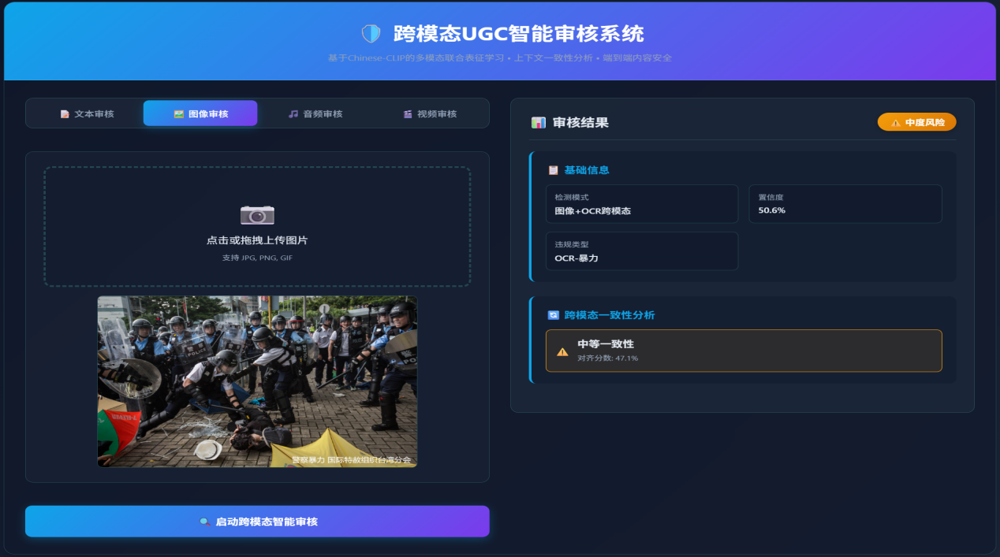
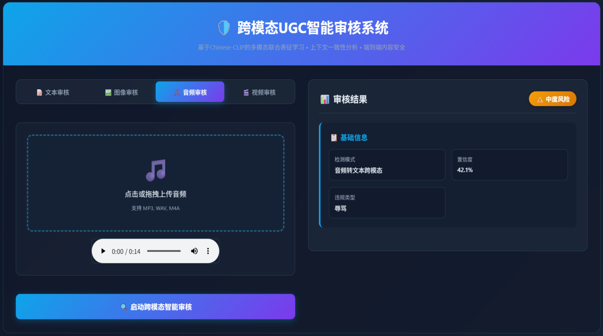
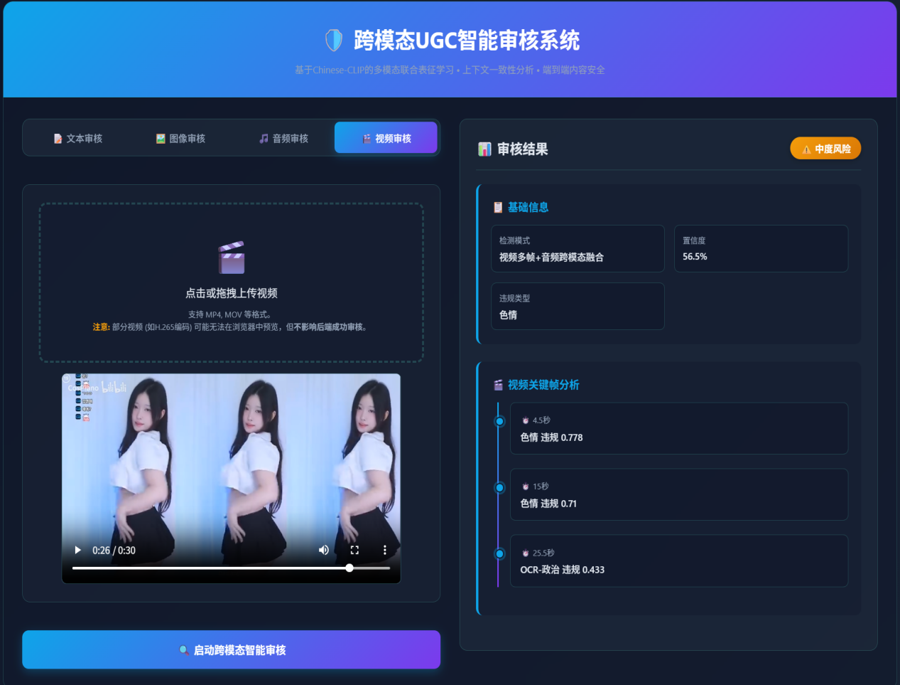

# UGC多模态智能审核原型演示系统

### 1. 构建统一的语义“度量衡”

利用 Chinese-CLIP 预训练跨模态模型，建立一个统一的、高维的语义空间。

### 2. 分而治之，单模态深度分析

在进行跨模态关联之前，系统首先会对每一种模态（文本、图像、音频）进行独立的、深入的“预处理”和分析，获取其自身包含的最大信息量。

- **对于文本**：执行两层检测，即快速的关键词匹配和能理解内涵的CLIP语义相似度分析。
- **对于图像**：执行两项任务，即Web OCR提取图中所有文字，并利用CLIP视觉模型直接理解图片内容（比如判断图片本身是否包含裸露、暴力等元素）。
- **对于音频/视频**：利用Whisper模型将音频模态转化为了文本模态进行分析。视频则被看作是“多张关键帧图片 + 一段音频”的集合体。

### 3. 关联验证，挖掘跨模态一致性

系统利用第一步建立的统一语义空间，来量化不同模态内容之间的关联程度，即计算“图文对齐分数”。

- **高一致性 (分数 > 0.7)**: 图文内容高度相关。如果图片是违规的，文字也在描述违规内容，这属于明确违规。
- **中等一致性 (0.4 < 分数 < 0.7)**: 图文内容有一定关联，但不完全等同。这往往指向隐蔽性、暗示性违规。例如，一张穿着暴露的女性图片（视觉上有风险），配上引流的微信号或暗示性服务的文字。两者共同构成了一个违规场景。
- **低一致性 (分数 < 0.4)**: 图文内容几乎无关。这通常是典型的“挂羊头卖狗肉”式作弊。例如，用一张正常的风景图作掩护，图片上用极小的文字写着违禁品广告。极低的对齐分数会立刻触发警报，标识为高度可疑的欺诈内容。

通过分析一致性，审核系统从“内容检测”升级到了“意图识别”，能够发现大量传统方法无法识别的复杂违规。

### 4. 多模态信息加权融合

最后，系统会将所有模态的分析结果（单模态分析结果 + 跨模态一致性分析结果）汇集起来，根据预设的权重（`CROSS_MODAL_CONFIG`）进行加权计算，得出一个最终的、综合的审核结论。

### 5. 系统演示

系统演示图1-4所示。

该原型系统有效地验证了跨模态审核的核心理念，但其依赖预训练模型和简单的权重融合，在面对新型对抗攻击和复杂的语义场景时仍有局限。
